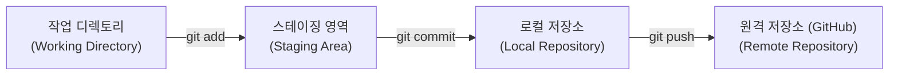

# Git & GitHub 통합 사용 가이드 (GIT_GUIDE.md)

본 문서는 버전 관리 시스템인 **깃(Git)**과 원격 코드 저장소 서비스인 **깃허브(GitHub)**를 활용하여 프로젝트 코드를 안전하게 관리, 백업, 협업하는 방법을 정리한 가이드라인입니다.

---

## 1. 🚨 원격 저장소 푸시(Push) 오류 해결 가이드

현재 `git push` 실행 시 아래와 같은 오류가 발생하는 경우의 대처법입니다.
> **오류 메시지**: `remote: Repository not found. / fatal: repository '...' not found`

### 1) 깃허브 웹사이트에 저장소가 생성되어 있는지 확인
*   가장 흔한 원인은 **깃허브 상에 `project-manager`라는 이름의 원격 저장소가 아직 물리적으로 만들어지지 않았기 때문**입니다.
*   **조치 방법**:
    1.  [GitHub](https://github.com/)에 로그인합니다.
    2.  우측 상단의 **[+]** 아이콘을 누르고 **[New repository]**를 클릭합니다.
    3.  Repository name에 **`project-manager`**를 입력합니다.
    4.  Public(공개) 또는 Private(비공개) 중 하나를 선택하고, **기타 초기화 옵션(README.md 추가, gitignore 추가 등)은 절대 체크하지 않은 채** 맨 아래 **[Create repository]** 버튼을 눌러 빈 저장소로 생성합니다.
    5.  저장소가 정상 생성되면, 터미널에서 다시 `git push -u origin main` 명령을 기동합니다.

### 2) 깃허브 계정 권한(자격 증명) 문제
*   저장소가 **비공개(Private)**로 생성되어 있는 경우, 로그인된 계정에 쓰기 권한이 없거나 자격 증명 토큰이 만료되면 깃허브가 보안을 위해 "저장소를 찾을 수 없다"고 응답합니다.
*   **조치 방법**:
    *   사용하고 계신 깃허브 계정이 `ninehyzzel-prog`가 맞는지 확인합니다.
    *   비밀번호 대신 **Personal Access Token (Classic)**을 발급받아 Git 자격 증명에 등록해 주어야 할 수 있습니다. (깃허브 [Settings] -> [Developer Settings] -> [Personal Access Tokens]에서 발급 가능)

### 3) 사용자 식별 정보 미설정 오류 (Author identity unknown)
*   새로운 컴퓨터에서 `git commit`을 처음 실행할 때 발생하는 설정 오류입니다. 깃허브에 커밋을 기록할 사용자의 이름과 이메일 정보가 누락되어 발생합니다.
*   **조치 방법**:
    터미널에 아래 두 명령어를 한 줄씩 입력하여 사용자를 등록한 뒤, 다시 커밋을 실행합니다.
    ```bash
    # 본인의 깃허브 이메일 등록
    git config --global user.email "your_email@example.com"
    
    # 본인의 닉네임 또는 이름 등록
    git config --global user.name "your_username"
    ```

---

## 2. Git & GitHub의 기본 개념

*   **Git (로컬 버전 관리)**: 내 컴퓨터(로컬)에서 코드의 변화를 기록하고 관리하는 도구입니다. 인터넷 연결 없이도 동작합니다.
*   **GitHub (원격 저장소)**: 로컬에서 관리한 Git 커밋 기록들을 인터넷상에 백업하고 다른 사람들과 공유할 수 있게 해주는 클라우드 서비스입니다.

---

## 3. 핵심 단어와 작업 흐름 (Workflow)



1.  **Working Directory (작업 디렉토리)**: 실제 코드를 수정하고 있는 내 컴퓨터의 폴더입니다.
2.  **Staging Area (스테이징 영역)**: 이번 커밋(기록)에 포함시킬 파일들을 임시로 찜해두는 공간입니다.
3.  **Local Repository (로컬 저장소)**: 내 컴퓨터의 `.git` 폴더에 버전 기록들이 영구 저장되는 공간입니다.
4.  **Remote Repository (원격 저장소)**: 깃허브 서버에 업로드된 공유 공간입니다.

---

## 4. 매일 쓰는 깃 핵심 명령어 7가지

새로운 컴퓨터로 소스를 옮기거나 매일 개발을 마칠 때 아래 순서대로 명령어를 사용합니다.

### ① 상태 확인하기
내가 어떤 파일을 고쳤고 무엇이 올라갈 준비가 되었는지 수시로 체크합니다.
```bash
git status
```

### ② 스테이징 (올릴 파일 고르기)
변경된 소스 코드를 커밋 대기 상태로 등록합니다.
```bash
# 변경된 모든 파일 추가 (단, .gitignore에 기재된 임시 빌드 파일 등은 제외됨)
git add .

# 특정 파일만 지정해서 추가할 때
git add src/components/ProjectOverview.tsx
```

### ③ 커밋 (로컬에 기록 저장)
버전 기록의 메시지를 상세히 적어 로컬 저장소에 영구 박제합니다.
```bash
git commit -m "feat: 프로젝트 종합개요 UI 리디자인 및 인력현황판 연동"
```

### ④ 푸시 (깃허브에 백업 업로드)
로컬에 기록된 커밋들을 원격 깃허브로 업로드합니다.
```bash
# 최초 1회 등록 시 (-u 옵션 추가)
git push -u origin main

# 이후 간편 업로드 시
git push
```

### ⑤ 풀 (깃허브에서 최신 코드 다운로드)
다른 컴퓨터에서 작업했거나 다른 사람이 올린 최신 버전을 내 로컬 PC로 가져와 병합합니다.
```bash
git pull
```

### ⑥ 커밋 로그(이력) 확인
지금까지 작성된 커밋의 히스토리 내역을 조회합니다.
```bash
git log --oneline
```

### ⑦ 브랜치 전환 및 생성 (가지치기)
독립적인 작업 공간을 만들거나 전환합니다.
```bash
# 신규 기능 개발을 위한 가지 생성
git checkout -b feature/new-chart

# main 브랜치로 복귀
git checkout main
```

---

## 5. 본 프로젝트(React + Express + Tauri) 관리 시 꿀팁

1.  **`.gitignore` 작동 원리 숙지**
    *   Tauri Rust 컴파일 중간 결과물이 담기는 `src-tauri/target/` 폴더와 프런트엔드 라이브러리인 `node_modules/` 폴더는 용량이 기가바이트(GB) 단위입니다.
    *   이 폴더들은 깃허브에 업로드하면 용량 제한 에러가 나므로, 반드시 `.gitignore`에 등록되어 제외되어야 합니다. (이미 제외 설정해 두었으니 안심하셔도 됩니다.)
2.  **데이터베이스 관리**
    *   `server/local.db` SQLite 파일은 개발 단계에서는 편리상 깃에 커밋하여 업로드할 수 있으나, 만약 여러 컴퓨터에서 동시에 작업할 때 충돌이 나기 쉽습니다.
    *   기본 데이터가 포함된 시드 DB 구조로 초기 1회 올린 뒤에는, 가능하면 `.gitignore`에 등록하거나 별도로 백업하여 보관하는 것이 안전합니다.
