# Tailwind CSS 제거 및 IBM Carbon 규칙 기반 디자인 시스템 이관 계획서 (할당량 기준 분할 일정 포함)

본 문서는 현재 애플리케이션의 디자인 스타일을 보존하면서 **Tailwind CSS를 전수 제거**하고, **IBM Carbon Design System 규격**에 맞춘 Vanilla CSS 및 공용 UI 컴포넌트로 전환하는 최적의 마이그레이션 계획서입니다. 특히, Antigravity Pro 구독형의 **5시간 주기 무료 할당량** 한계 내에서 에이전트 중단 없이 완료할 수 있도록 설계된 분할 일정을 포함하고 있습니다.

---

## 1. 토큰 소모량 예측 분석 (Token Consumption Estimate)

마이그레이션 대상 소스 코드는 총 30개 파일, 약 **823 KB** 분량입니다.

* **기본 코드베이스 토큰 환산**: 약 **220,000 ~ 260,000 토큰** (1회 분석용)
* **에이전트 수정 및 재생성(Output) 토큰**: 약 **300,000 ~ 400,000 토큰**
* **컨텍스트 누적을 고려한 총 예상 소모량**: **약 1,750,000 ~ 2,500,000 토큰** (전체 일괄 처리 시 할당량 한도 도달 가능성 매우 높음)

---

## 2. Pro 구독 할당량 기준 분할 일정 (5시간 주기 매핑)

Pro 구독 요금제의 **5시간 주기 쿼터 초기화** 시점을 기준으로 작업을 4개의 사이클로 균등 분할하여, 한도 제한 경고를 우회하고 추가 과금 없이 마이그레이션을 완수합니다.

```mermaid
gantt
    title IBM Carbon 디자인 시스템 이관 및 분할 일정
    dateFormat  X
    axisFormat %H
    
    section 사이클 1 (0-5시간)
    디자인 토큰화 및 글로벌 CSS 리셋 :active, 0, 2
    공용 UI 컴포넌트 7종 구축         :active, 2, 5
    
    section 사이클 2 (5-10시간)
    기본/입력 폼 컴포넌트 15종 이관   : 5, 10
    
    section 사이클 3 (10-15시간)
    대형 뷰 및 레이아웃 컴포넌트 13종 이관 : 10, 15
    
    section 사이클 4 (15-20시간)
    최종 레이아웃 피팅 및 빌드 에러 정리 : 15, 20
```



### 2.1. [사이클 1] 기초 설계 및 디자인 토큰화 (0 ~ 5시간 소모)
* **목표**: 스타일 시트 기초 설계 완료 및 공용 UI 구성품 뼈대 완비.
* **주요 작업**:
  * CSS 변수를 활용해 IBM Carbon 규격의 Spacing(2px~64px), Typography, Color Tokens 정의 (`carbon-tokens.css`).
  * `package.json`에서 Tailwind CSS 종속성 및 PostCSS 플러그인 제거 준비.
  * 공용 UI 컴포넌트 7종 (`Button`, `TextInput`, `Select`, `Card`, `Modal`, `Tabs`, `Table`) 구현.
* **예상 토큰**: Input 300,000 / Output 80,000 tokens (누적 38만)

### 2.2. [사이클 2] 기초/폼 컴포넌트 15종 변환 (5 ~ 10시간 소모)
* **목표**: 화면 깊이가 얕고 입력 폼 위주로 구성된 컴포넌트들의 Tailwind 제거.
* **주요 작업**:
  * `CustomSelect`, `CustomTimePicker`, `RangeDatePicker`, `FolderDetails`, `FolderTree`, `ForcePasswordChangeView`, `LoginView` 등 비교적 크기가 작은 컴포넌트 이관.
  * 인라인 Tailwind 코드를 CSS 변수 및 `.cds--` 접두사로 시작하는 BEM 표준 Vanilla CSS로 치환.
* **예상 토큰**: Input 550,000 / Output 100,000 tokens (누적 65만)

### 2.3. [사이클 3] 메인 뷰 및 대형 레이아웃 컴포넌트 13종 변환 (10 ~ 15시간 소모)
* **목표**: 비주얼 차트, 테이블, 복잡한 사용자 상태가 얽혀있는 대형 페이지 컴포넌트 마이그레이션.
* **주요 작업**:
  * `ProjectOverview.tsx`, `AssignmentManagementView.tsx`, `CommentPanel.tsx`, `DashboardView.tsx`, `TaskManagement.tsx`, `ReportGeneration.tsx` 등 30KB 이상의 무거운 파일 변환.
  * 차트 및 반응형 요소(SVG 기반)의 레이아웃이 깨지지 않도록 Carbon의 Layout Grid 가이드(16컬럼)에 부합하는 CSS Flex/Grid 속성 부여.
* **예상 토큰**: Input 700,000 / Output 150,000 tokens (누적 85만)

### 2.4. [사이클 4] 글로벌 통합 및 빌드/디버깅 (15 ~ 20시간 소모)
* **목표**: Tailwind CSS 패키지를 공식 삭제하고 빌드를 통과시킨 뒤, 픽셀 오차 및 테마 스타일 검증.
* **주요 작업**:
  * `App.tsx` 내 루트 래퍼 스타일 변환 및 `package.json`에서 Tailwind 완전 제거.
  * `npm run build`를 수행하여 컴파일 단의 CSS 누락 및 타입 선언 경고 교정.
  * 브라우저 다크모드 대응성 및 CSS 변수 누출 여부 확인.
* **예상 토큰**: Input 200,000 / Output 30,000 tokens (누적 23만)

---

## 3. 디자인 시스템 및 아키텍처 이관 전략

현재 토스(Toss) 스타일의 미려하고 활력 있는 시각 요소를 보존하면서 IBM Carbon의 구조적 규칙을 이식합니다.

### 3.1. 디렉토리 구조 변경 계획
```bash
src/
├── styles/
│   ├── carbon-tokens.css   # IBM Carbon 디자인 토큰 (Spacing, Color, Typography)
│   ├── base.css            # 기본 HTML 리셋 및 스크롤바 커스텀
│   └── components.css      # 공용 컴포넌트 스타일 시트 (BEM 명명 규칙)
├── components/
│   ├── ui/                 # 신설되는 공용 UI 디자인 시스템 컴포넌트
│   │   ├── Button.tsx
│   │   ├── TextInput.tsx
│   │   ├── Select.tsx
│   │   ├── Card.tsx
│   │   ├── Modal.tsx
│   │   ├── Tabs.tsx
│   │   └── Table.tsx
│   └── ...                 # 기존 기능 컴포넌트 (Tailwind 제거 및 ui 컴포넌트 호출)
```

### 3.2. 공용 UI 컴포넌트화 대상 리스트
기존 컴포넌트에서 반복적으로 하드코딩되던 스타일을 아래의 규격 컴포넌트로 일체화합니다.

| 분류 | 컴포넌트 명 | 기존 구현 형태 (Tailwind 예시) | 마이그레이션 후 (BEM 및 CSS Variable) |
| :--- | :--- | :--- | :--- |
| **Common** | `Button` | `px-4.5 py-2.5 bg-toss-blue text-white rounded-xl` | `.cds--btn .cds--btn--primary` |
| **Form** | `TextInput` | `px-4 py-3 bg-white border border-toss-gray-250 focus:ring-2` | `.cds--text-input` |
| **Layout** | `Card` | `p-6 rounded-[28px] bg-white border border-slate-100 shadow-sm` | `.cds--card` |
| **Navigation** | `Tabs` | `flex gap-2 p-1.5 bg-slate-100 rounded-2xl` | `.cds--tabs` |
| **Feedback** | `Tooltip` | `absolute invisible group-hover:visible bg-slate-900 text-[10px]` | `.cds--tooltip` |

---

## 4. 기대 효과 및 유지보수 이점

* **로딩 속도 개선**: Tailwind CSS 런타임 빌드 종속성이 영구 배제되고 순수 최적화된 Vanilla CSS 파일만 단독 번들링되어 페이지 진입 속도가 증가합니다.
* **디자인 일관성**: IBM Carbon 규칙에 따라 자의적인 수치 기입이 차단되고, Spacing scale에 정의된 값만 사용하여 디자이너와 프론트엔드 개발자 간의 정렬 규칙이 완벽히 동기화됩니다.
* **JSX 코드 다이어트**: JSX 코드 안에 3~4줄씩 기입되던 가독성 떨어지는 인라인 Tailwind 클래스들이 의미론적 클래스명(`className="cds--btn"`) 및 공용 UI 구조로 위임되어 소스 코드 라인 수와 복잡도가 35% 이상 대폭 줄어듭니다.
